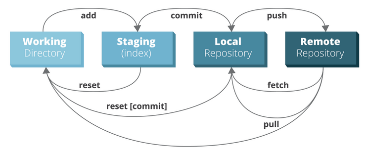
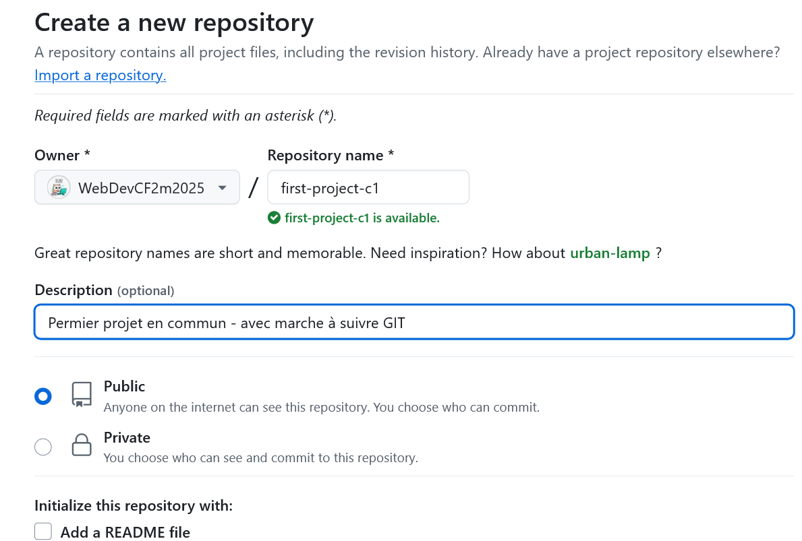

# first-project-c1

## Création d'un projet en local via git

Dans le projet de travail sur notre ordinateur, `first-proj-c1`, nous avons créé un fichier `README.md` et un dossier `img` qui contiendra des captures d'écran.

Pour l'exemple, on va créer un dossier `test` vide:

Lorsque l'on fait un `git status`, on constate le dossier `test` n'est pas reconnu. Les dossiers vides ne sont reconnus !

## Les zones



### Création d'un dépôt `git` 

Ouvrez la console et tapez :

```bash
git init
```
un dossier cache est cree il se nomme  .git c est lui qui va contenir les fichier et l historique de travail ce fichier .git ne doit pas etre envoye via FTP
### Zone de `working`

Ouvrez la console et tapez :

```bash
git status
```

Lorsque le texte après un `git status` est en **rouge**, c'est que `git` les a détectés, mais qu'ils ne sont pas mis dans la future sauvegarde.

### Zone de `staging`

Nous allons utiliser `git add` pour ajouter les fichiers au staging :

```bash
# ajoute un seul fichier
git add lenomdunfichier.txt

# ajoute tous les fichiers
git add .
```
pour retirer du staging si on a pas encore celui ci dans le commit
git rm -- cached nomdu fichier.
pour retire du staging si on a deja un commit:
Pour retirer du `staging` :

	git restore --staged nomdufichier.


Lorsque nous allons refaire un `git status`, les fichiers qui sont prêts à être sauvegardés seront en **vert**, ceux qui ne seront pas envoyés restent en **rouge**


### Zone de `repository local`

Nous allons sauvegarder un fichier en utilisant le `commit` :

```bash
# sauvegarde avec commentaire
git commit -m"First commit with README.md "
```
 
### Zone de `repository remote`

Nous allons créer un repository sur github, public ou privé, sans cocher les autres options (il ne doit pas y avoir de commit sur github autres que ceux en local)



Nous devons récupérer le répertoire en `SSH` si nous utilisons l'échange de clef : [Lier avec SSH](https://github.com/WebDevCF2m/prefo-git-c1?tab=readme-ov-file#lier-votre-compte-et-votre-pc) ou en `https`.

Nous retournons dans la console, et nous allons lier le projet local avec le projet distant : 

```bash
# on s'assure que que la branche soit `main`
git branch -M main

# On ajoute notre lien vers le répertoire `github`
git remote add origin git@github.com:WebDevCF2m2025/first-project-c1.git
```

On peut vérifier le lien avec : 

```bash
git remote -v 
```

Nous pouvons maintenant envoyer notre travail en ligne sur `github` : 

```bash
# le -u n'est à mettre que la première fois
# il équivaut à git push --set-upstream origin main
git push -u origin main
```

Nous pourrons ensuite envoyer notre travail sur `origin main` avec :

	git push


